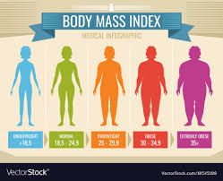

### MidTermExam
There are two classes in the Midterm Exam project:

- MidtermExam.java

- ExamTest.java

The method (getBMI) helps in calculating the Body Mass Index of an individual using one's body weight and height.This helps people in detecting if one is overweight or healthy. It is helpful and can be used in hospitals or clinics for obecity diagnosis. Below is a chart/illustration showing the different levels of Body Mass index

